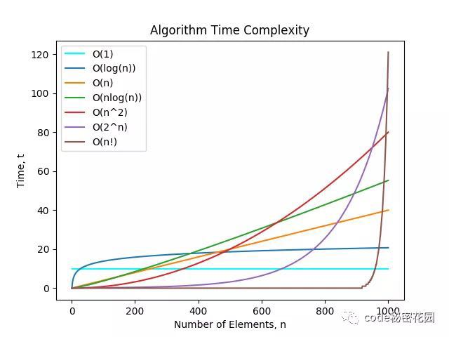

| 常用语 | 翻译                                                   |
| ---- | ------------------------------------------------------------ |
| n的5次方 | n to the fifth power |
| lgN | log based 2 N |
| quadric | 二次的 |
| cubic |  三次的 |
| ~ NlgN | proportional to NlgN |

Theta, O, Omega, Tilde记号：

| 记号       | 含义                   |
| ---------- | ---------------------- |
| Theta(N^2) | c1N^2 <= f(n) <= c2N^2 |
| O(N^2)     | f(n) <=cN^2            |
| Omega(N^2) | cN^2 <= f(N)           |

误区：把O(N)当做近似模型，应该用 ~ N

Time complexity:

