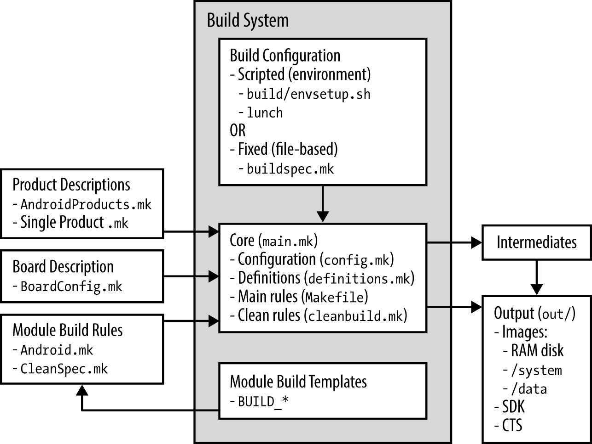
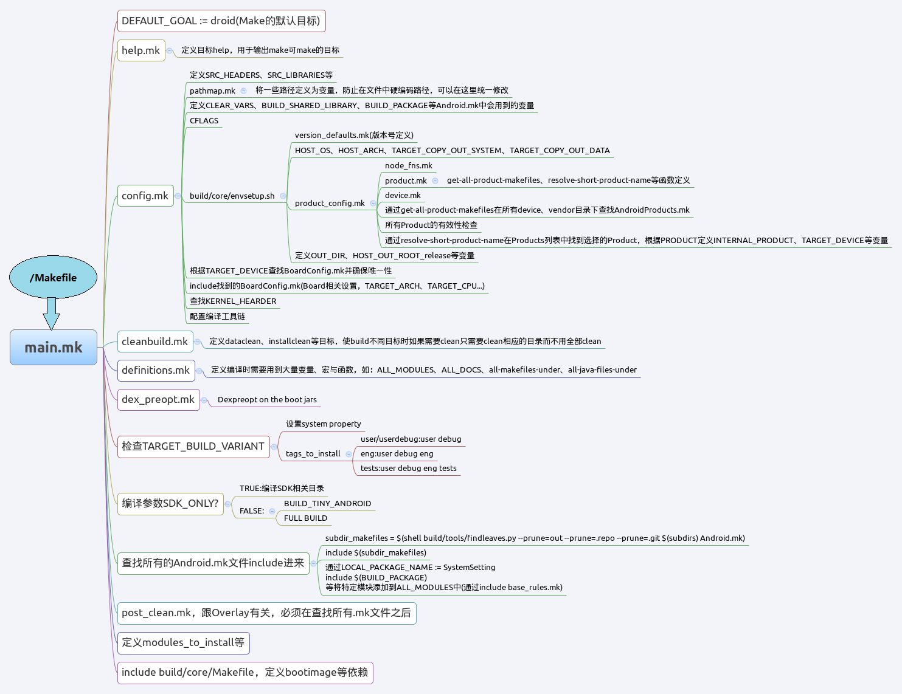
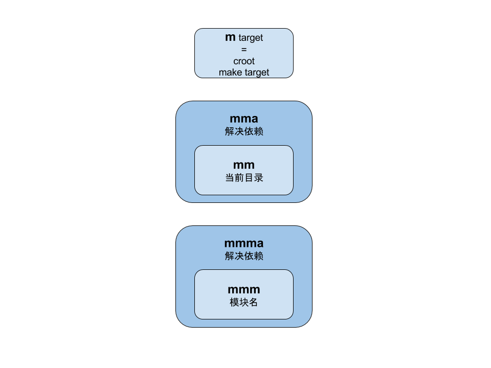
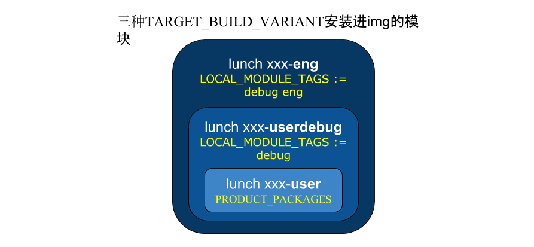

[TOC]

----------

与其他编译系统的比较
--
了解Android build system的为什么这样设计可以读一读 [Recursive Make Considered Harmful](http://aegis.sourceforge.net/auug97.pdf)  和  [build/core/buildsystem.html](http://www.netmite.com/android/mydroid/2.0/build/core/build-system.html)

下面是一些总结：

- 不像linux kernel那样，有一个顶层的makefile会递归地调用子目录的makefiles。
Android build system用脚本搜索所有的文件夹，直到找到Android.mk文件，并停止继续搜索这个Android.mk文件所在的目录的子目录，除非该Android.mk文件有写`include $(call all-subdir-makefiles)`或者`include $(LOCAL_PATH)/xxx/Android.mk`之类的。


One Android.mk == One module， 一个Android.mk对应一个编译模块。
一共有多少Android.mk呢？在Android 6.0上：
```
$ find . -name Android.mk | wc -l
2646
```
- .o等编译中间文件和.c等源文件不在同一个目录下，所有编译生成的文件都在out目录下。
- 不像linux kernel那样可以配置的选项非常多，android能配置的只有：envsetup.sh, lunch, buildspec.mk。
想配置enable, disable某个模块请看下面的“编译和安装”部分。

----------

架构
--




Sequence of load vendor makefiles：
  
*BoardConfig.mk: 硬件相关的定义。*

再深入细节一点可以仔细看下面这个眼花缭乱的大图：
   

----------

编译命令
--

命令 | 详细说明
------------ | -------------
m | Makes from the top of the tree.<br/>带参数：模块名，或者不带参数：默认目标droid。<br/>对make的简单封装，m target1可以在任意目录下执行，相当于转到根目录执行make target1
mm | Builds all of the modules in the current directory, but not their dependencies.<br/>不带参数，编译当前目录（如果当前目录没有Android.mk就往上查找父目录直到找到Android.mk）下的所有模块，不编译所依赖的模块。
mmm | Builds all of the modules in the supplied directories, but not their dependencies.<br/>`mmm <dir-1> <dir-2> ... <dir-N>[:module-1,module-2,...,module-M]`.<br/>带参数：其中，dir-1、dir-2、dir-N都是包含有Android.mk文件的目录。在最后一个目录dir-N的后面可以带一个冒号，冒号后面可以通过逗号分隔一系列的模块名称module-1、module-2和module-M，用来表示要编译前面指定的Android.mk中的哪些模块。不编译所依赖的模块。
mma | Builds all of the modules in the current directory, and their dependencies.<br/>同mm但会同时编译所依赖的模块。
mmma | Builds all of the modules in the supplied directories, and their dependencies.<br/>同mmm但会同时编译所依赖的模块。
文字看晕了的话记住下面这张图就好了：
   
**总结**：
mma和mmma是从Jellybean4.3开始新加入的命令，比对应的mm和mmm智能多了，不需要当前目录包含Android.mk，会解决依赖问题。

但是会消耗更多的时间来检查依赖的模块是否都编译成功。

----------

Android.mk
--
Android.mk 文件通常以以下两行代码作为开头：
```
    LOCAL_PATH := $(call my-dir) 
    include $(CLEAR_VARS)
```
这两行代码的作用是：

1. 设置当前模块的编译路径为当前文件夹路径。

2. 清理（可能由其他模块设置过的）编译环境中用到的变量。

> 这两行代码的顺序不能倒过来哦！

这是为什么呢？请看下面的分析：

首先我们要知道`$(CLEAR_VARS)`的值是build/core/clear_vars.mk；

然后再要去理解my-dir函数，定义在build/core/definitions.mk里：
```
###########################################################
## Retrieve the directory of the current makefile
## Must be called before including any other makefile!!
###########################################################

# Figure out where we are.
define my-dir
$(strip \
  $(eval LOCAL_MODULE_MAKEFILE := $$(lastword $$(MAKEFILE_LIST))) \
  $(if $(filter $(BUILD_SYSTEM)/% $(OUT_DIR)/%,$(LOCAL_MODULE_MAKEFILE)), \
    $(error my-dir must be called before including any other makefile.) \
   , \
    $(patsubst %/,%,$(dir $(LOCAL_MODULE_MAKEFILE))) \
   ) \
 )
endef
```
my-dir函数通过`$$(lastword $$(MAKEFILE_LIST))`拿到最后读取的makefile，然后通过`$(patsubst %/,%,$(dir $(LOCAL_MODULE_MAKEFILE)))`得到最后读取的makefile的路径。

最后要知道gnu make 会自动将所有读取的makefile路径都会加入到MAKEFILE_LIST变量中，而且是按照读取的先后顺序添加。

那么分析开始了，在运行本makefile文件时，`$(MAKEFILE_LIST)`字符串中最后一个makefile肯定是最后读取的makefile，即`$(lastword $(MAKEFILE_LIST))`则会返回`当前路径/Android.mk`，my-dir函数则会得到当前路径。

如果我们在`include $(CLEAR_VARS)`之后，再调用my-dir函数，那么`$$(lastword $$(MAKEFILE_LIST))`肯定就会返回build/core/clear_vars.mk，my-dir函数得到的值就是build/core，而不是当前的路径了。

这么一来得到的LOCAL_PATH的值就是错误的值，依赖LOCAL_PATH的其他变量也就更加不可能是正确的了！所以说 ，LOCAL_PATH必须要在任何`including $(CLEAR_VARS))`之前定义 。

----------
编译静态库、动态库、apk、签名版apk等模块的Android.mk要怎么写请看[Android.mk写法实例](http://www.cnblogs.com/hesiming/archive/2011/03/15/1984444.html)。

为了方便模块的编译，Build 系统设置了很多的编译环境变量。要编译一个模块，只要在编译之前根据需要设置这些变量然后执行编译即可。它们包括：

LOCAL_SRC_FILES：当前模块包含的所有源代码文件。

LOCAL_MODULE：当前模块的名称，这个名称应当是唯一的，模块间的依赖关系就是通过这个名称来引用的。

LOCAL_C_INCLUDES：C 或 C++ 语言需要的头文件的路径。

LOCAL_STATIC_LIBRARIES：当前模块在静态链接时需要的库的名称。

LOCAL_SHARED_LIBRARIES：当前模块在运行时依赖的动态库的名称。

LOCAL_CFLAGS：提供给 C/C++ 编译器的额外编译参数。

LOCAL_JAVA_LIBRARIES：当前模块依赖的 Java 共享库。

LOCAL_STATIC_JAVA_LIBRARIES：当前模块依赖的 Java 静态库。

LOCAL_PACKAGE_NAME：当前 APK 应用的名称。

LOCAL_CERTIFICATE：签署当前应用的证书名称。

LOCAL_MODULE_TAGS：当前模块所包含的标签，一个模块可以包含多个标签。标签的值可能是 debug, eng或者optional。其中optional 是默认标签。标签是提供给编译类型TARGET_BUILD_VARIANT使用的。不同的编译类型会安装包含不同标签的模块，关于编译类型的说明下面来讲。

----------

编译和安装
--
> 首先我们要知道并不是所有编译了的模块都会安装打包进img，有的模块是只编译不安装的哦！

module 在单独mmm编译的时候，是可以安装到out中的system对应位置的，最后能够打包进系统的system.img。
但是如果整体的 make -j* 编译系统，那么module就会先生成在out下的**symbols**/system对应的位置，最后会不会打包进系统system.img要看module 的LOCAL_MODULE_TAGS和当前的编译的TARGET_BUILD_VARIANT没有满足下面表格中的规则。

 - 三种编译类型TARGET_BUILD_VARIANT与安装模块的规则

名称 | 详细说明
 ------------ | -------------
 eng | 默认类型，该编译类型适用于**开发**阶段。当选择这种类型时，编译结果将：<br/>安装包含 eng, debug标签的模块;<br/>安装所有没有标签的非 APK 模块;<br/>安装所有PRODUCT_PACKAGES宏中指定的 APK 模块;<br/>编译出的系统具有 root 访问权限;<br/>ro.secure=0;<br/>ro.debuggable=1;<br/>ro.kernel.android.checkjni=1;<br/>adb enabled
 userdebug | 该编译类型适合用于 **debug** 阶段。当选择这种类型时，编译结果将：<br/>安装所有带有 debug标签的模块;<br/>安装所有没有标签的非 APK 模块;<br/>安装所有PRODUCT_PACKAGES宏中指定的 APK 模块<br/>编译出的系统具有 root 访问权限;<br/>ro.secure=1;<br/>ro.debuggable=1;<br/>adb enabled
 user | 该编译类型适合用于**最终发布**阶段。当选择这种类型时，编译结果将：<br/>安装所有没有标签的非 APK 模块;<br/>忽略APK 模块的标签，安装哪些模块只依赖PRODUCT_PACKAGES宏;<br/>编译出的系统**不具有** root 访问权限;<br/>ro.secure=1;<br/>ro.debuggable=0;<br/>关闭log, console, adb, 编译出odex

*odex的作用：系统制作会把.odex 和 apk 一起放到system/app 下，由系统来调度使用，如果想盗版apk，单独copy出去.apk是不能用的，这样可以起到一定程度上的保护作用！*

表格里的文字看晕了的话记住下面这张图就好了：
    

**总结：**
这里可以看到对module的安装控制级别最高的是 PRODUCT_PACKAGES 这个变量。

不满足的规则的module只会被编译，并不会被install 的。

如果需要安装打包进system.img则可以按照上面表格中的规则，修改module的 LOCAL_MODULE_TAGS 或者在 PRODUCT_PACKAGES 中添加 module。

**比如：**
LOCAL_MODULE_TAGS的默认值是optional，则该module会被编译但不会install。如果希望install的话可以：

1. PRODUCT_PACKAGES += 该module名称

2. 修改LOCAL_MODULE_TAGS := 对应的TARGET_BUILD_VARIANT(eng/debug)

----------

暂时就写这么多啦，以后有需要再补充~
欢迎指导和提意见 :blush:

> Written with [StackEdit](https://stackedit.io/).