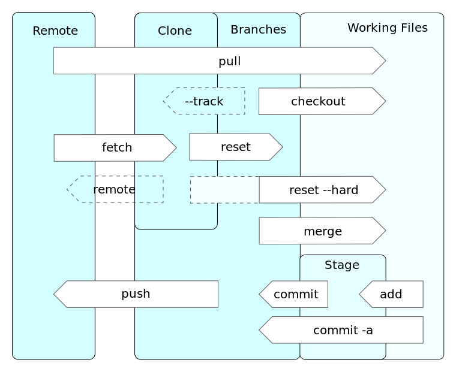
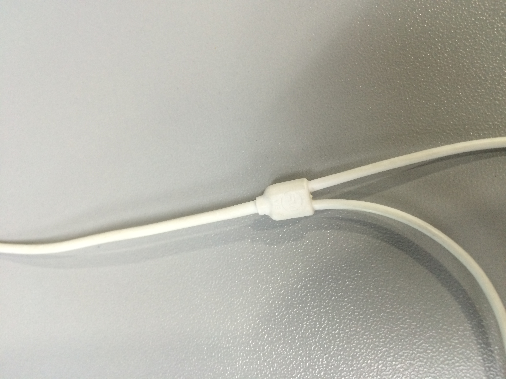
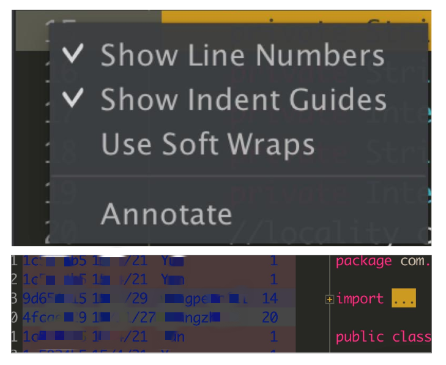

[TOC]

----------

为什么用git+gerrit+jenkins三剑客做代码版本控制
--

**烦恼：**

 - 经常没有一个好的基础版本来发布和开发，一更新代码发现又跑不起来；
 - 辛苦改好的代码进不去版本库；
 - 不是我的bug却要我来花时间;
 - 开发团队人越多，集成越困难……

**好处：**

 - 版本历史有迹可查（git）；
 - 提交前代码检查，坏代码不会污染代码库（gerrit&jenkins）；
 - 快速定位问题；
 - 方便管理多项目；
 - 方便团队合作……

> git+gerrit+jenkins三剑客： 灵活，快速，强大，好用。

git各种命令与状态：



想详细了解更多git技能推荐阅读：[Git Community Book 中文版](http://gitbook.liuhui998.com/)

本文挑了最最实用、最最常用的技能，方便大家快速掌握，提高工作效率。

在理解下面的技能前，希望大家先在脑海中形象滴理解下git branch和git commit:

> 把branch理解成一条流水线，把commit理解成乐高积木。

> branch这条流水线是由一个一个commit积木组成的。

----------

更新代码
--

> 不要用git pull, 改用git fetch + git rebase

因为`git pull`会做`git merge`产生讨厌的merge commit。

**merge commit是什么？**

git中两个branch合并的时候，需要做个标记，这是我们合并的点，就像两根绳子打个结：

   

这个结就是`git merge`时生成的merge commit。

**merge commit为啥就讨厌了？**

如果是重要的branch合并，我们会需要个merge commit作为见证。就像结婚说誓词时需要个证婚人一样。

但是你平时说话就不需要见证了，不然太累了。

因为你的本地branch根本不重要，跟主线master合并的时候不需要留下见证。

主线只要你的commit并不想要整个branch。

**解决办法**：

```
    git fetch origin
    git rebase origin/master
```
`git rebase`做的动作就是把你的commit挪到主线的最顶端。

**rebase过程中出现冲突怎么办？**

 1. `git status` 看下哪个文件冲突了？（假设是src/java/a.java有冲突）
 2. 打开这个文件，解决冲突
 3. `git add src/java/a.java` 
 4. `git rebase --continue`

----------

提交
--

 - **提交前自检**： 过一遍自己刚才改了什么

```
    git status
    git diff
```
git命令都可以加路径来指定文件或者目录，这几个命令也不例外。

比如：

`git status .` 查看当前目录下修改的文件。

`git diff src/java/franny.java` 查看franny.java文件的具体修改。

 - **提交**

```
	git commit
	git push origin HEAD:refs/for/master
```
`git commit .` 提交当前目录下修改的文件；

`git commit src/java/a.java src/java/b.java` 只提交a.java, b.java这两个文件。

`refs/for` 表示提交到gerrit上，走代码review流程，由有权限的人review过才给你合进代码库。

与其对应的是`refs/heads`和`refs/tags`直接提交进代码库，普通群众是没有这个权限的就不说了。

----------

还原文件
--

**常用场景**：

哎呀，我修改了几十个文件还分散个各种不同目录下，其中有一个文件（假设叫a.java）不需要提交咋办，用`git commit file1 file2 file3 ...` 太麻烦。

**解决办法**：

那么就先把a.java还原成未修改的状态： `git checkout src/java/a.java`

然后`git commit -a` 一次性提交全部文件。

----------

合并多个提交
--

**常用场景**：

哎呀，我的修改提交了2个commit，我想把它们合并成一个commit然后push。

```
$ git log
commit bbb6ca1ddca3b7b59f299c5b9e6bb0c8dc965793
Author: Zhao Fengyi <fengyi@zhao.com>
Date:   Tue Aug 23 20:10:49 2016 +0800

    this is my 3rd commit

commit 72fa1768fe5db08323394fe1f4a3fb8d71b7c712
Author: Zhao Fengyi <fengyi@zhao.com>
Date:   Tue Aug 23 20:10:09 2016 +0800

    this is my 2nd commit

commit 87ee65f7ff23afacbbe98c62965b243557e3a3e0
Author: Zhao Fengyi <fengyi@zhao.com>
Date:   Tue Aug 23 20:09:55 2016 +0800

    this is my 1st commit

```
即： 我想把后面的2个提交合并成一个提交。

**解决办法有3种**：

 - 第一种办法
```
git reset <the 1st commit> 把后面2个提交的文件变成未提交状态
git add . ; git commit -am "blabla" 把所有为提交的文件一次性提交
```
具体执行过程：
```
$ git status
On branch master
nothing to commit, working directory clean
```
```
$ git reset 87ee65f7ff23afacbbe98c62965b243557e3a3e0
```
```
$ git status
On branch master
Untracked files:
  (use "git add <file>..." to include in what will be committed)

	b.java
	c.java

nothing added to commit but untracked files present (use "git add" to track)
```
```
$ git add . ; git commit -am "merge 2 commits together"
[master 5115542] merge 2 commits together
 2 files changed, 24 insertions(+)
 create mode 100644 src/java/b.java
 create mode 100644 src/java/c.java
```
```
$ git log
commit 5115542312503fc0422d48e531d12ee506384cd4
Author: Zhao Fengyi <fengyi@zhao.com>
Date:   Tue Aug 23 20:16:22 2016 +0800

    merge 2 commits together

commit 87ee65f7ff23afacbbe98c62965b243557e3a3e0
Author: Zhao Fengyi <fengyi@zhao.com>
Date:   Tue Aug 23 20:09:55 2016 +0800

    this is my 1st commit

```
 - 第二种办法
```
git checkout <the 1st commit>
git merge --squash <the 2nd commit> <the 3rd commit>
git commit -a
```
具体执行过程：
```
$ git checkout 87ee65f7ff23afacbbe98c62965b243557e3a3e0
Note: checking out '87ee65f7ff23afacbbe98c62965b243557e3a3e0'.

You are in 'detached HEAD' state. You can look around, make experimental
changes and commit them, and you can discard any commits you make in this
state without impacting any branches by performing another checkout.

If you want to create a new branch to retain commits you create, you may
do so (now or later) by using -b with the checkout command again. Example:

  git checkout -b new_branch_name

HEAD is now at 87ee65f... this is my first commit
```
```
$ git merge 72fa1768fe5db08323394fe1f4a3fb8d71b7c712 bbb6ca1ddca3b7b59f299c5b9e6bb0c8dc965793 --squash
Updating 87ee65f..bbb6ca1
Fast-forward
Squash commit -- not updating HEAD
 src/java/b.java | 12 ++++++++++++
 src/java/c.java | 12 ++++++++++++
 2 files changed, 24 insertions(+)
 create mode 100644 src/java/b.java
 create mode 100644 src/java/c.java
```
```
$ git status
HEAD detached at 87ee65f
Changes to be committed:
  (use "git reset HEAD <file>..." to unstage)

	new file:   b.java
	new file:   c.java
```
```
$ git commit -a
[detached HEAD 0212114] Squashed commit of the following:
 2 files changed, 24 insertions(+)
 create mode 100644 src/java/b.java
 create mode 100644 src/java/c.java
```
```
$ git log
commit 021211462df14dae5084842b85c0122222dcc453
Author: Zhao Fengyi <fengyi@zhao.com>
Date:   Tue Aug 23 20:26:32 2016 +0800

    Squashed commit of the following:
    
    commit bbb6ca1ddca3b7b59f299c5b9e6bb0c8dc965793
    Author: Zhao Fengyi <fengyi@zhao.com>
    Date:   Tue Aug 23 20:10:49 2016 +0800
    
        this is my 3rd commit
    
    commit 72fa1768fe5db08323394fe1f4a3fb8d71b7c712
    Author: Zhao Fengyi <fengyi@zhao.com>
    Date:   Tue Aug 23 20:10:09 2016 +0800
    
        this is my 2nd commit

commit 87ee65f7ff23afacbbe98c62965b243557e3a3e0
Author: Zhao Fengyi <fengyi@zhao.com>
Date:   Tue Aug 23 20:09:55 2016 +0800

    this is my 1st commit

```

 - 第三种办法（防患于未然，推荐）：
```
为某个问题修改了一些文件
git commit -am "blabla"

为同样的问题又做了些修改
git commit -a --amend
```

----------

找不同版本的区别
--

**常用场景**：

这个bug上个版本还没有，这个版本怎么就出现了呢？我得看看上个版本和这个版本之间都改了什么。

**解决办法**：

 - 粗糙版命令（适用于版本之间提交不多，<10个吧）

```
git log <branchA/tagA/commitA>..<branchB/tagB/commitB> -- <path>
```
具体执行过程：
```
src/main/java/com/xxx/yyy/ui/activity$ git log origin/v7.7..origin/v7.8 -- .
commit aaaaaaaaaaaaaaaaaaaaaaaaaaaa
Author: Y <y@q.com>
Date:   Tue Aug 23 18:12:33 2016 +0800

    [需求开发]......
    
    Change-Id: ......

commit bbbbbbbbbbbbbbbbbbbbbbbbbbbbbbbbbbb
Author: l <l@q.com>
Date:   Tue Aug 23 15:26:21 2016 +0800

    【bug fixed】......

commit cccccccccccccccccccccccccccccccccccccc
Author: G <g@q.com>
Date:   Tue Aug 23 16:32:20 2016 +0800

    需求-从第三方跳入......
    
    Change-Id: ......

commit ddddddddddddddddddddddddddddddddddd
Author: S <s@q.com>
Date:   Tue Aug 23 10:12:26 2016 +0800

    [功能优化]去掉无用的xxx.java
    
    Change-Id: ......

```
缺点是太多了，排版不紧凑，找个信息要半天。

 - 精致版命令（紧凑，不费眼）

```
git log <branchA/tagA/commitA>..<branchB/tagB/commitB> --color --graph --pretty=format:'%Cred%h%Creset -%s %Cgreen(%cr) %C(bold blue)<%an>%Creset' -- <path>
```
具体执行过程：
```
src/main/java/com/xxx/yyy/ui/activity$ git log origin/v7.7..origin/v7.8 --color --graph --pretty=format:'%Cred%h%Creset -%s %Cgreen(%cr) %C(bold blue)<%an>%Creset' -- . 

* a30af7c -[需求开发] ... (16 hours ago) <Y>
* cacb3f5 -【bug fixed】... (18 hours ago) <l>
* b332d79 -需求-从第三方跳入... (18 hours ago) <G>
* 0385105 -[功能优化] 去掉无用的 xxx.java (18 hours ago) <S>
```

----------

这锅该谁背
--

**常用场景**：

找到了，就是这行代码改出来的问题，看看谁改的。

**解决办法**：

`git blame <file> -L <行数>`
Android Studio有提供同样的操作：

   

**高级一点的需求**：

`git blame` 只能看到谁加了这行，如果知道有些代码被删了，想看看谁删了怎么办呢？

**解决办法**：

```
git log -p -- <file>
```
在打印里搜索被删除的行。

具体执行过程：
```
src/main/java/com/xxx/yyy/ui/view/message$ git log -p -- LLLView.java
搜索
xxxManager\.getyyy\(\)\.play
```

----------

方便的配置
--
作为一个熟悉git的人，我平时提交代码只需要1行命令就搞定了
```
 git f && git rh && git rbm && git sa && git pm
```

要想操作这么便捷，做一些前期配置就可以一劳永逸了。

 - 缩写alias

git 这么多命令，敲起来又长又麻烦，一不小心敲错了就更烦了。

打开 ~/.gitconfig， 把下面的缩写添加进去
```
[alias]
	co = checkout
	cp = cherry-pick
	br = branch
	st = status
	l1 = log -1
	pm = push origin HEAD:refs/for/master
	ap = apply
	cm = commit
	rbm = rebase origin/master
	f = fetch origin
	rh = reset --hard
	sa = stash apply --0
```

- 各种平台换行符不一致，git提交时统一转换：
```
git config --global core.autocrlf true
git config --global core.autocrlf true
```

- 暂存不用提交的修改

比如gradle project sync耗时太久，我改成用本地的服务器：
```
distributionUrl=http\://10.x.y.z:8080/download/gradle-2.12-all.zip
```
这个修改又不需要提交，只是本地开发时需要。

我们一般把不需要提交的修改用`git stash`暂存在本地；

需要提交的修改`git commit`提交到本地。

这样要提交的修改和不需要提交的修改就分开了，不会出现每次提交代码要自己再分离一次。

----------


配置好了，git commit了需要提交的代码后，可以一行命令搞定推送到gerrit了。
```
 git f && git rh && git rbm && git sa && git pm
```

命令 | 详细说明
------------ | -------------
git f | git fetch origin 从git服务器获取最新代码状态
git rh | git reset --hard 清空本地不需要提交的代码
git rbm | git rebase origin/master 把自己的commit合并进master
git sa | git stash apply --0 恢复暂存的修改
git pm | git push origin HEAD:refs/for/master 推到gerrit

然后继续开发下一个commit吧～

----------

其他
--

有时候会遇到一些棘手的问题。

- 比如：之前`git commit`了一个提交，然后做了一堆`git checkout`或者别的操作导致找不到这个commit了。
```
vi .git/logs/HEAD
或者
git reflog
```
都可以查看你的操作历史。曾经从哪里checkout到哪里，commit了什么，rebase到哪里了...都一目了然。

- 比如：之前解决了一次冲突，然后发现不应该这么解决，想换种办法解决。
但是git会自动记住你之前的解决办法，自动帮你解决了，你根本没有插手的机会。
```
rm -rf .git/rr-cache/*
```
让git忘记我之前的解决办法，这样就给了我插手的机会，重新解决一次。

----------

暂时就写这么多啦，以后有需要再补充~
欢迎指导和提意见 :blush:

> Written with [StackEdit](https://stackedit.io/).